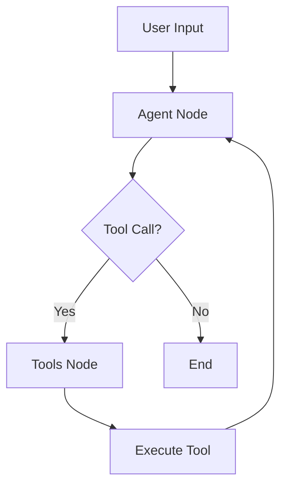

# LinkedIn Job Search & Application Agent

An intelligent agentic AI system built with **LangGraph** and **LangChain** to automate LinkedIn job searching and application processes.

## 🎯 Quick Start (Chat Mode)

Get up and running in 3 minutes:

```bash
# 1. Install dependencies
pip install -r requirements.txt

# 2. Set your API key
export ANTHROPIC_API_KEY=your_key_here

# 3. Start the agent
langgraph dev
```

4. **Click the "Chat" tab** in LangGraph Studio
5. Start chatting: `"Find me ML engineer jobs in Seattle"`

That's it! 🎉 See [CHAT_MODE_GUIDE.md](CHAT_MODE_GUIDE.md) for detailed usage.

### Current Features
- ✅ Intelligent job search based on user criteria
- ✅ Detailed job information retrieval
- ✅ AI-powered cover letter generation
- ✅ Conversational interface for job hunting
- ✅ Tool-calling agent architecture with LangGraph

### Planned Features (Extensible)
- 🔄 Automated job applications via LinkedIn Easy Apply
- 🔄 Resume optimization for specific jobs
- 🔄 Application tracking and status monitoring
- 🔄 Referral network analysis
- 🔄 Interview preparation assistance
- 🔄 Salary research and negotiation tips
- 🔄 Browser automation with Playwright
- 🔄 Persistent storage with MongoDB/PostgreSQL

## 📋 Prerequisites

- Python 3.10 or higher
- Anthropic API key (for Claude)
- LangSmith account (optional, for monitoring)

## 🛠️ Installation

### 1. Clone and Setup

```bash
# Create project directory
mkdir linkedin-job-agent
cd linkedin-job-agent

# Create virtual environment
python -m venv venv

# Activate virtual environment
# On macOS/Linux:
source venv/bin/activate
# On Windows:
venv\Scripts\activate

# Install LangGraph CLI
pip install langgraph-cli
```

### 2. Project Structure

Create the following structure:

```
linkedin-job-agent/
├── linkedin_agent/
│   ├── __init__.py
│   ├── agent.py          # Main agent code
│   ├── tools.py          # Extended tools
│   └── utils.py          # Utility functions
├── .env                   # Environment variables
├── .env.example          # Example environment file
├── requirements.txt      # Python dependencies
├── langgraph.json        # LangGraph configuration
├── README.md             # This file
└── DEPLOYMENT.md         # Production deployment guide
```

### 3. Install Dependencies

```bash
pip install -r requirements.txt
```

### 4. Configure Environment

```bash
# Copy example environment file
cp .env.example .env

# Edit .env and add your API keys
nano .env  # or use your preferred editor
```

**Required variables:**
```bash
ANTHROPIC_API_KEY=your_anthropic_api_key_here
```

**Optional but recommended:**
```bash
LANGCHAIN_TRACING_V2=true
LANGCHAIN_API_KEY=your_langsmith_key_here
LANGCHAIN_PROJECT=linkedin-job-agent
```

## 🚀 Running the Agent

### Option 1: Using LangGraph Studio (Recommended)

Start the development server with hot reloading:

```bash
langgraph dev
```

This will:
1. Start the LangGraph server on `http://127.0.0.1:2024`
2. Open LangGraph Studio in your browser
3. Enable hot-reloading for development

**LangGraph Studio URL:**
```
https://smith.langchain.com/studio/?baseUrl=http://127.0.0.1:2024
```

#### Using Chat Mode in LangGraph Studio

The agent supports **Chat mode** for a simplified conversational interface:

1. After running `langgraph dev`, LangGraph Studio will open
2. Click the **"Chat"** tab at the top (next to "Graph")
3. You'll see a clean chat interface similar to ChatGPT
4. Start chatting with your job search agent!

**Chat mode features:**
- ✅ Simple, user-friendly interface
- ✅ Real-time streaming responses
- ✅ Automatic message history management
- ✅ Perfect for business users and testing
- ✅ No need to manually configure state

**Graph mode features:**
- ✅ Full technical details and execution visualization
- ✅ Node-by-node execution tracking
- ✅ State inspection and time travel debugging
- ✅ LangSmith integration (datasets, annotations)
- ✅ Perfect for developers and debugging

💡 **Tip:** Use Chat mode for quick testing and demos, Graph mode for debugging and development!

### Option 2: Using Python SDK

```python
from langgraph_sdk import get_sync_client

client = get_sync_client(url="http://localhost:2024")

# Stream responses
for chunk in client.runs.stream(
    None,
    "linkedin_job_agent",
    input={
        "messages": [{
            "role": "human",
            "content": "Find me AI engineer jobs in San Francisco"
        }]
    },
    stream_mode="values"
):
    print(chunk)
```

### Option 3: Direct Python Execution

```bash
python linkedin_agent/agent.py
```

## 🎯 Usage Examples

### Example 1: Basic Job Search (Real LinkedIn Jobs!)

```
User: Find me machine learning engineer jobs in New York

Agent: I'll search for machine learning engineer positions in New York for you.
[Searches LinkedIn and fetches REAL jobs...]
    
Found 15 LIVE jobs from LinkedIn:

1. Senior ML Engineer at OpenAI
   Location: New York, NY (Hybrid)
   Salary: $180k-$250k
   Posted: 2 days ago
   URL: https://www.linkedin.com/jobs/view/3789456123
   
2. Machine Learning Engineer at Google
   Location: New York, NY
   Posted: 1 week ago
   URL: https://www.linkedin.com/jobs/view/3789456124

Would you like more details on any of these positions?
```

### Example 2: Job Application with Cover Letter

```
User: Apply to the TechCorp position and generate a cover letter

Agent: I'll generate a personalized cover letter for the Senior ML Engineer 
position at TechCorp. Let me analyze the job requirements first...

[Generates cover letter based on job description and your profile]

Here's your cover letter:
[Shows generated cover letter]

Would you like me to proceed with the application?
```

### Example 3: Filtering and Analysis

```
User: Show me only remote positions that mention Python and deep learning

Agent: Filtering jobs for remote positions with Python and deep learning...
[Applies filters...]
Found 8 matching positions. Here are the top 3:
[Shows filtered results with match scores]
```

## 🏗️ Architecture

### Agent Flow



### Key Components

1. **StateGraph**: Manages conversation state and job search context
2. **Agent Node**: Main reasoning node using LLM with tool binding
3. **Tools Node**: Executes tools (search, apply, generate cover letter)
4. **Conditional Edges**: Routes between agent and tools based on LLM decision

### Tools Available

| Tool | Description | Status |
|------|-------------|--------|
| `search_linkedin_jobs` | Search LinkedIn for real jobs | ✅ Live |
| `get_job_details` | Get detailed job information | ✅ Live |
| `generate_cover_letter` | Create personalized cover letter | ✅ Implemented |
| `apply_to_job` | Apply to a job posting | ⚙️ Stub (Ready to extend) |
| `update_user_preferences` | Save job search preferences | 📋 Available in tools.py |
| `analyze_job_match` | Match score for job fit | 📋 Available in tools.py |
| `find_referrals` | Find connections at companies | 📋 Available in tools.py |

## 🔧 Configuration

### langgraph.json

```json
{
  "dependencies": ["."],
  "graphs": {
    "linkedin_job_agent": "./linkedin_agent/agent.py:graph"
  },
  "env": ".env"
}
```

### Customizing the Agent

**Change the LLM model:**

```python
# Use Claude Sonnet 4 (default)
llm = ChatAnthropic(model="claude-sonnet-4-20250514", temperature=0)

# Or use Claude Opus 4.1 for more complex reasoning
llm = ChatAnthropic(model="claude-opus-4-20250514", temperature=0)

# Or switch to OpenAI (requires OPENAI_API_KEY)
from langchain_openai import ChatOpenAI
llm = ChatOpenAI(model="gpt-4o", temperature=0)
```

**Add custom tools:**

```python
@tool
def my_custom_tool(param: str) -> dict:
    """Your tool description"""
    # Implementation
    return {"result": "success"}

# Add to tools list
tools = [search_linkedin_jobs, my_custom_tool]
```

**Modify system prompt:**

Edit the `SystemMessage` content in `agent_node()` function.

## 📊 Monitoring with LangSmith

Enable tracing to monitor agent performance:

```bash
export LANGCHAIN_TRACING_V2=true
export LANGCHAIN_API_KEY=your_api_key
export LANGCHAIN_PROJECT=linkedin-job-agent
export ANTHROPIC_API_KEY=your_anthropic_key
```

View traces at: https://smith.langchain.com

## 🔐 Security Notes

⚠️ **Important Security Considerations:**

1. **Never commit `.env` file** - Add to `.gitignore`
2. **LinkedIn credentials** - Use environment variables only
3. **Rate limiting** - Implement to avoid account restrictions
4. **API quotas** - Monitor Anthropic/LLM usage
5. **User data** - Encrypt stored resumes and applications

## 🚧 Next Steps for Extension

The foundation is complete! Here are ideas for extending the agent:

### Job Application Automation
Currently stubbed - ready to implement with:
- Browser automation (Playwright/Selenium)
- Form filling and submission
- LinkedIn Easy Apply integration
- Application confirmation and tracking

### Resume Optimization
Use LLM to:
- Parse existing resumes
- Optimize for specific job descriptions
- Highlight relevant experience
- Format for ATS systems

### Advanced Tracking
Implement with database (MongoDB/PostgreSQL):
- Application history
- Status updates
- Interview scheduling
- Follow-up reminders

### Networking Features
- Connection analysis
- Referral requests
- Message drafting
- Network visualization

See the extended tools in `linkedin_agent/tools.py` for ready-to-use functions!

## 🧪 Testing

The agent includes built-in test functionality:

```bash
# Test the scraper directly
python linkedin_agent/real_linkedin_scraper.py

# Test the main agent
python linkedin_agent/agent.py

# Run with LangGraph Studio (recommended)
langgraph dev
```

All core features are working and ready to use!

## 📈 Future Enhancements

Ideas for extending the agent beyond current functionality:

### Application Automation
- [ ] Browser automation for Easy Apply
- [ ] Automated form filling
- [ ] Application status tracking
- [ ] Follow-up scheduling

### Advanced Features
- [ ] Multi-agent system with specialized roles
- [ ] RAG for job description analysis
- [ ] Resume parsing and optimization
- [ ] Interview scheduling assistant
- [ ] Salary negotiation advisor
- [ ] Network analysis for referrals
- [ ] Email integration
- [ ] Mobile app interface
- [ ] Voice interface
- [ ] Analytics dashboard

All foundational features are complete - these are optional enhancements!

## 🤝 Contributing

1. Fork the repository
2. Create a feature branch (`git checkout -b feature/AmazingFeature`)
3. Commit changes (`git commit -m 'Add AmazingFeature'`)
4. Push to branch (`git push origin feature/AmazingFeature`)
5. Open a Pull Request

## 🔗 Resources

- [LangGraph Documentation](https://langchain-ai.github.io/langgraph/)
- [LangChain Documentation](https://python.langchain.com/)
- [LangSmith](https://smith.langchain.com/)
- [LinkedIn Developer Portal](https://developer.linkedin.com/)

## 💡 Tips

- Start with the mock implementation to understand the flow
- Test thoroughly before connecting to real LinkedIn
- Use LangSmith for debugging agent behavior
- Implement rate limiting to avoid API restrictions
- Store user data securely with encryption

## 🐛 Troubleshooting

### "Graph not found" error
- ✅ Already configured in `langgraph.json`
- Check that file is in project root
- Verify the graph path matches: `./linkedin_agent/agent.py:graph`

### Import errors
- Activate virtual environment
- Run `pip install -r requirements.txt`
- Check Python version (3.10+)

### LangGraph Studio not opening
- Ensure port 2024 is not in use
- Try `langgraph dev --port 8080`
- Check firewall settings

### No jobs found
- ✅ Real scraping is working
- LinkedIn may be rate-limiting
- Try broader search terms
- Add delay between searches

## 📧 Support

For issues and questions:
- Open an issue on GitHub
- Check LangChain Discord
- Review LangGraph documentation

---

Built with ❤️ using LangGraph and LangChain